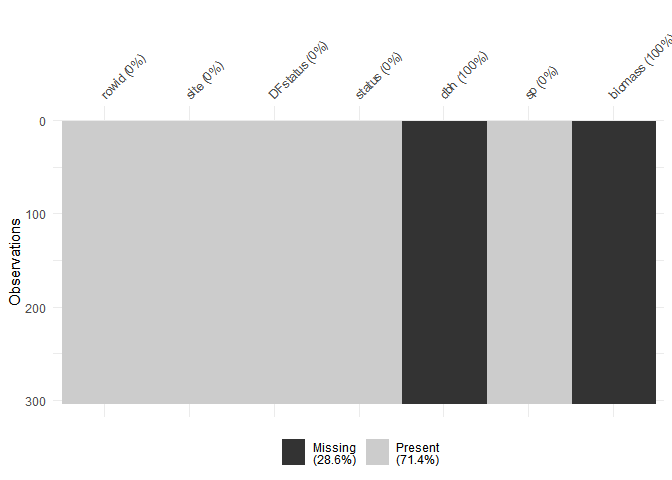

Plot dbh vs. biomass by species
================

``` r
# Setup
library(tidyverse)
#> -- Attaching packages ---------------------------------------------------------- tidyverse 1.2.1 --
#> v ggplot2 3.1.0       v purrr   0.3.2  
#> v tibble  2.1.1       v dplyr   0.8.0.1
#> v tidyr   0.8.3       v stringr 1.4.0  
#> v readr   1.3.1       v forcats 0.4.0
#> -- Conflicts ------------------------------------------------------------- tidyverse_conflicts() --
#> x dplyr::filter() masks stats::filter()
#> x dplyr::lag()    masks stats::lag()
library(fgeo.biomass)
```

-----

The goal is to plot dbh (x) versus biomass (y) by species
([issue](https://github.com/forestgeo/allodb/issues/73)).

Let’s first drop rows with missing `dbh` values as we can’t calculate
biomass for them.

``` r
census <- fgeo.biomass::scbi_tree1 %>% 
  filter(!is.na(dbh))
```

Let’s find allometric equations in allodb and calculate biomass.

``` r
species <- fgeo.biomass::scbi_species
census_species <- census %>% 
  add_species(species, site = "SCBI")
#> Adding `site`.
#> Overwriting `sp`; it now stores Latin species names.
#> Adding `rowid`.

census_equations <- allo_find(census_species)
#>   Guessing `dbh` in [mm] (required to find dbh-specific equations).
#> You may provide the `dbh` unit manually via the argument `dbh_unit`.
#> * Matching equations by site and species.
#> * Refining equations according to dbh.
#> * Using generic equations where expert equations can't be found.
#> Warning:   Can't find equations matching these species:
#>   acer sp, carya sp, crataegus sp, fraxinus sp, juniperus virginiana, quercus prinus, quercus sp, ulmus sp, unidentified unk
#> Warning: Can't find equations for 17132 rows (inserting `NA`).
```

Notice the warning that equations couldn’t be found. This is in part
because, for this site, some species in the data couldn’t be matched
with a corresponding species in allodb, and/or because the equations
available are not adequate for the dbh range the doesn’t include the
actual dbh values in the data. Later we will fall back to using generic
equations but we don’t support that feature yet. For now we can’t
calculate `biomass` for rows containing those species so we will now
drop them.

``` r
# Useless for now
census_equations %>% 
  filter(is.na(eqn_id)) %>% 
  select(rowid, site, sp, eqn_id)
#> # A tibble: 17,132 x 4
#>    rowid site  sp                   eqn_id
#>    <int> <chr> <chr>                <chr> 
#>  1     1 scbi  lindera benzoin      <NA>  
#>  2     2 scbi  lindera benzoin      <NA>  
#>  3     3 scbi  lindera benzoin      <NA>  
#>  4     4 scbi  nyssa sylvatica      <NA>  
#>  5     5 scbi  hamamelis virginiana <NA>  
#>  6     7 scbi  unidentified unk     <NA>  
#>  7     9 scbi  viburnum prunifolium <NA>  
#>  8    10 scbi  asimina triloba      <NA>  
#>  9    11 scbi  asimina triloba      <NA>  
#> 10    12 scbi  asimina triloba      <NA>  
#> # ... with 17,122 more rows

# Dropping useless rows to continue
census_equations2 <- census_equations %>% 
  filter(!is.na(eqn_id))
```

We can now calculate `biomass`.

``` r
biomass <- allo_evaluate(census_equations2)
#> Guessing `dbh` in [mm]
#> You may provide the `dbh` unit manually via the argument `dbh_unit`.
#> Converting `dbh` based on `dbh_unit`.
#> `biomass` values are given in [kg].
#> Warning: Can't evaluate all equations (inserting 245 missing values):
#> object 'dba' not found
#> Warning: `biomass` may be invalid. This is still work in progress.
biomass
#> # A tibble: 14,049 x 2
#>    rowid biomass
#>    <int>   <dbl>
#>  1     6   NA   
#>  2     8    5.69
#>  3    17   11.3 
#>  4    21  231.  
#>  5    22   10.3 
#>  6    23   NA   
#>  7    26    4.15
#>  8    29  469.  
#>  9    34    3.44
#> 10    38    4.96
#> # ... with 14,039 more rows
```

We now learn that some equations couldn’t be evaluated. The problem now
is that we still don’t support the ability to calculate biomass from
values of `dba` which results in missing `biomass` values. Let’s confirm
this

``` r
census_equations_biomass <- census_equations2 %>% right_join(biomass)
#> Joining, by = "rowid"
census_equations_biomass %>% 
  filter(is.na(biomass)) %>% 
  select(rowid, site, sp, dbh, eqn, biomass)
#> # A tibble: 245 x 6
#>    rowid site  sp                     dbh eqn                biomass
#>    <int> <chr> <chr>                <dbl> <chr>                <dbl>
#>  1     6 scbi  hamamelis virginiana  22.5 38.111 * (dba^2.9)      NA
#>  2    23 scbi  hamamelis virginiana  24.9 38.111 * (dba^2.9)      NA
#>  3    69 scbi  hamamelis virginiana  37.8 38.111 * (dba^2.9)      NA
#>  4    81 scbi  hamamelis virginiana  12   38.111 * (dba^2.9)      NA
#>  5    88 scbi  hamamelis virginiana  28.3 38.111 * (dba^2.9)      NA
#>  6    91 scbi  hamamelis virginiana  21.4 38.111 * (dba^2.9)      NA
#>  7   108 scbi  hamamelis virginiana  35.3 38.111 * (dba^2.9)      NA
#>  8   109 scbi  hamamelis virginiana  38.2 38.111 * (dba^2.9)      NA
#>  9   133 scbi  hamamelis virginiana  26.6 38.111 * (dba^2.9)      NA
#> 10   134 scbi  hamamelis virginiana  17.4 38.111 * (dba^2.9)      NA
#> # ... with 235 more rows
```

Let’s drop the corresponding rows as we can’t do much with
them.

``` r
census_equations_biomass2 <- census_equations_biomass %>% filter(!is.na(biomass))
```

Now let’s box plot `biomass` by species.

``` r
census_equations_biomass2 %>% 
  ggplot(aes(sp, biomass)) +
  geom_boxplot() +
  ylab("biomass [kg]") +
  coord_flip()
```

<!-- -->

Let’s see what `dbh` versus `biomass` looks like now.

``` r
census_equations_biomass2 %>% 
  # Convert agb from [Mg] to [kg]
  mutate(agb_kg = agb * 1e3) %>% 
  ggplot(aes(dbh, biomass)) + 
  # Reference based on allometries for tropical trees
  geom_point(aes(y = agb_kg), color = "grey", size = 4) +
  geom_point(aes(y = biomass, color = sp)) +
  ylab("Reference `agb` (grey) and calculated biomass (black) in [kg]") +
  xlab("dbh [mm]") +
  theme(legend.position = "bottom")
```

<!-- -->

And now lets facet the plot by species.

``` r
census_equations_biomass2 %>% 
  # Convert agb from [Mg] to [kg]
  mutate(agb_kg = agb * 1e3) %>% 
  ggplot(aes(x = dbh)) +
  geom_point(aes(y = agb_kg), size = 1.5, color = "grey") +
  geom_point(aes(y = biomass), size = 1, color = "black") +
  facet_wrap("sp", ncol = 4) +
  ylab("Reference `agb` (grey) and calculated `biomass` (black) in [kg]") +
  xlab("dbh [mm]") +
  theme_bw()
```

<!-- -->
