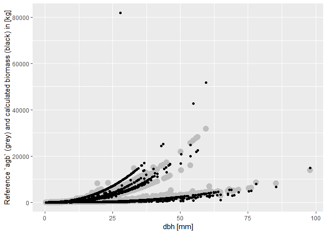
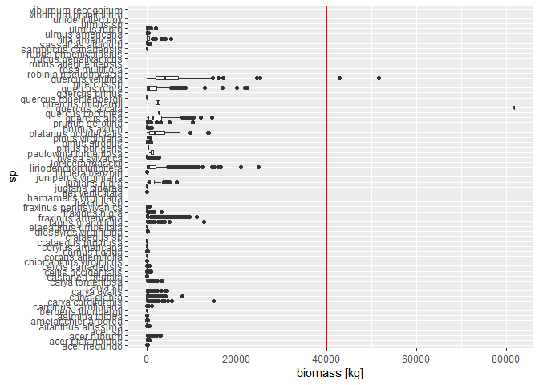
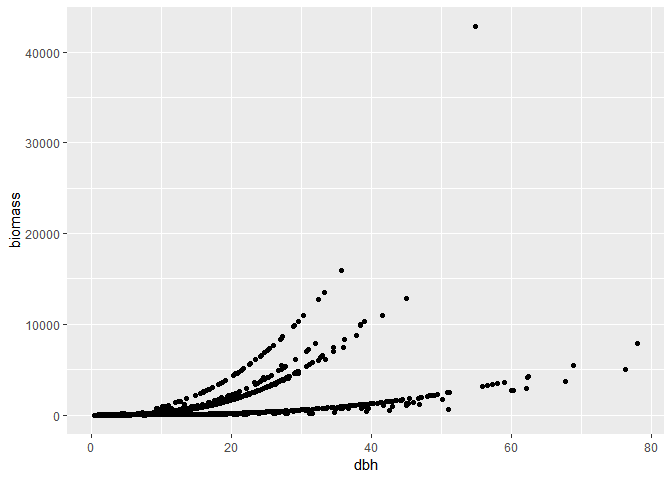
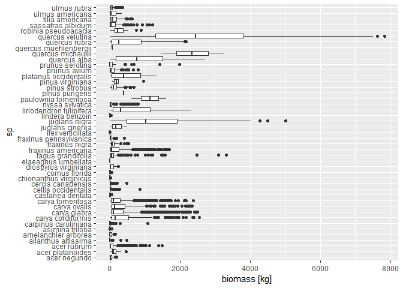

Plot dbh vs. biomass by species
================

``` r
# Setup
library(tidyverse)
#> -- Attaching packages --------------------------------------------- tidyverse 1.2.1 --
#> v ggplot2 3.1.0       v purrr   0.3.1  
#> v tibble  2.0.1       v dplyr   0.8.0.1
#> v tidyr   0.8.3       v stringr 1.4.0  
#> v readr   1.3.1       v forcats 0.4.0
#> -- Conflicts ------------------------------------------------ tidyverse_conflicts() --
#> x dplyr::filter() masks stats::filter()
#> x dplyr::lag()    masks stats::lag()
library(fgeo.biomass)
```

-----

The goal is to plot dbh (x) versus biomass (y) by species
([issue](https://github.com/forestgeo/allodb/issues/73)).

Let’s first drop rows with missing `dbh` values as we can’t calculate
biomass for them.

``` r
census <- fgeo.biomass::scbi_tree1 %>% 
  filter(!is.na(dbh))
```

Let’s find allometric equations in allodb and calculate biomass.

``` r
species <- fgeo.biomass::scbi_species
census_species <- census %>% 
  add_species(species, site = "SCBI")
#> Adding `site`.
#> Overwriting `sp`; it now stores Latin species names.
#> Adding `rowid`.

census_equations <- allo_find(census_species)
#> Assuming `dbh` data in [mm].
#> Joining, by = c("sp", "site")
#> Converting `dbh` based on `dbh_unit`.
#> Warning: Can't convert all units (inserting 1899 missing values):
#> the 'to' argument is not an acceptable unit.

biomass <- allo_evaluate(census_equations)
#> Assuming `dbh` units in [cm] (to convert units see `?measurements::conv_unit()`).
#> `biomass` values are given in [kg].
#> Warning: Can't convert all units (inserting 1899 missing values):
#> the 'from' argument is not an acceptable unit.
#> Warning: Can't evaluate all equations (inserting 819 missing values):
#> object 'dba' not found
#> Warning: 
#>     `biomass` may be invalid.
#>     We still don't suppor the ability to select dbh-specific equations
#>     (see https://github.com/forestgeo/fgeo.biomass/issues/9).
#> 
biomass
#> # A tibble: 31,181 x 2
#>    rowid biomass
#>    <int>   <dbl>
#>  1     1   1.30 
#>  2     2   0.879
#>  3     3   0.750
#>  4     4 136.   
#>  5     5  NA    
#>  6     6  NA    
#>  7     7  NA    
#>  8     8   5.69 
#>  9     9  NA    
#> 10    10   0.211
#> # ... with 31,171 more rows
```

Now let’s plot `dbh` vs. `biomass` and use the preexisting `agb` column
as a coarse reference.

``` r
census_equations_biomass <- census_equations %>% right_join(biomass)
#> Joining, by = "rowid"

census_equations_biomass %>% 
  # Convert agb from [Mg] to [kg]
  mutate(agb_kg = agb * 1e3) %>% 
  ggplot(aes(dbh, biomass)) + 
  # Reference based on allometries for tropical trees
  geom_point(aes(y = agb_kg), color = "grey", size = 4) +
  geom_point(aes(y = biomass)) +
  ylab("Reference `agb` (grey) and calculated biomass (black) in [kg]") +
  xlab("dbh [mm]")
#> Warning: Removed 1209 rows containing missing values (geom_point).
#> Warning: Removed 2028 rows containing missing values (geom_point).
```

<!-- -->

Values over 40,000 appear to be outliers.

``` r
census_equations_biomass %>% 
  ggplot(aes(sp, biomass)) +
  geom_hline(yintercept = 4e4, color = "red") +
  geom_boxplot() +
  ylab("biomass [kg]") +
  coord_flip()
#> Warning: Removed 2028 rows containing non-finite values (stat_boxplot).
```

<!-- -->

Let’s identify the odd `rowid`s to later exclude them. This should
improve the plots. But we need to check if this equations are correct.
(Remember the code doesn’t yet handle height-dependent allometries;
could this be the problem?)

``` r
# Saving rowid to later exclude them
odd_rowids <- census_equations_biomass %>% 
  filter(biomass > 4e4) %>% 
  mutate(agb = agb * 1e3) %>% 
  select(rowid, sp, equation_id, eqn, biomass, agb) %>% 
  # Show the data as it is up to this point, then continue to get odd rowid
  print() %>% 
  pull(rowid) %>% 
  unique()
#> # A tibble: 6 x 6
#>   rowid sp            equation_id eqn                        biomass    agb
#>   <int> <chr>         <chr>       <chr>                        <dbl>  <dbl>
#> 1 10311 quercus velu~ 7640f0      2.1457 * (dbh^2.503)        42803. 26603.
#> 2 10311 quercus velu~ c70dea      10^(1.00005 + 2.10621 * (~  42803. 26603.
#> 3 14883 quercus falc~ 81397c      2.30252 * (dbh^2)^1.6839    81866.  5632.
#> 4 14883 quercus falc~ 6943b4      2.23731 * (dbh^2)^1.26394   81866.  5632.
#> 5 19273 quercus velu~ 7640f0      2.1457 * (dbh^2.503)        51701. 31636.
#> 6 19273 quercus velu~ c70dea      10^(1.00005 + 2.10621 * (~  51701. 31636.

odd_rowids
#> [1] 10311 14883 19273
```

Let’s remove the odd `rowid`s and plot again, this time mapping each
species by color.

``` r
census_equations_biomass %>% 
  filter(!rowid %in% odd_rowids) %>% 
  # Convert agb from [Mg] to [kg]
  mutate(agb_kg = agb * 1e3) %>% 
  ggplot(aes(dbh)) + 
  # Reference based on allometries for tropical trees
  geom_point(aes(y = agb_kg), color = "grey", size = 4) +
  # Removing the legend to keep the plot simple
  geom_point(aes(y = biomass, color = sp)) +
  guides(color = "none") +
  ylab("Reference `agb` (grey) and calculated `biomass` (black) in [kg]") +
  xlab("dbh [mm]")
#> Warning: Removed 1209 rows containing missing values (geom_point).
#> Warning: Removed 2028 rows containing missing values (geom_point).
```

<!-- -->

We can see two groups of data-points: Those that rise above about 10,000
kg and those that don’t. Let’s add a horizontal reference to clearly see
those groups, and let’s facet the plot to identify each species.

``` r
census_equations_biomass %>% 
  filter(!rowid %in% odd_rowids) %>% 
  # Convert agb from [Mg] to [kg]
  mutate(agb_kg = agb * 1e3) %>% 
  ggplot(aes(x = dbh)) +
  geom_hline(yintercept = 1e4, color = "red") +
  geom_point(aes(y = agb_kg), size = 1.5, color = "grey") +
  geom_point(aes(y = biomass), size = 1, color = "black") +
  facet_wrap("sp", ncol = 4) +
  ylab("Reference `agb` (grey) and calculated `biomass` (black) in [kg]") +
  xlab("dbh [mm]") +
  theme_bw()
#> Warning: Removed 1209 rows containing missing values (geom_point).
#> Warning: Removed 2028 rows containing missing values (geom_point).
```

<!-- -->
