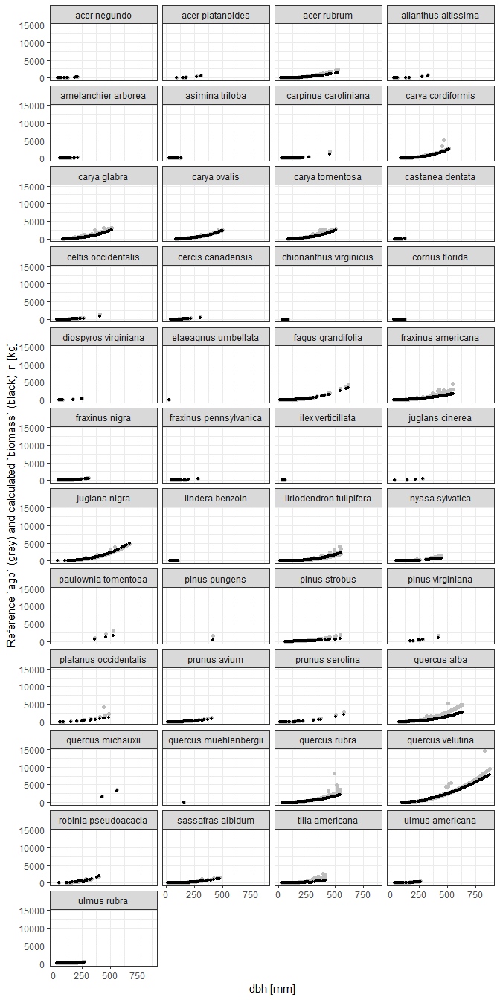
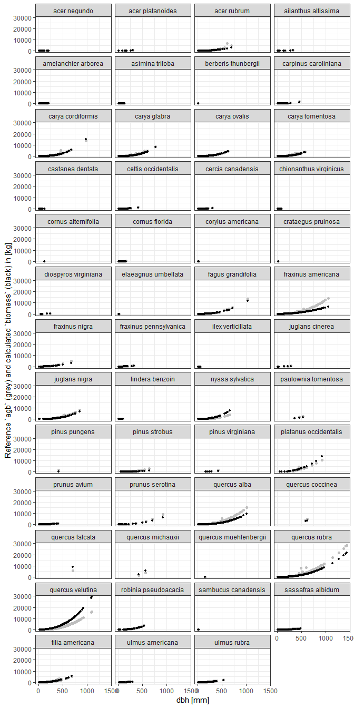

Plot dbh vs. biomass by species
================

``` r
# Setup
library(tidyverse)
#> -- Attaching packages --------------------------------------------- tidyverse 1.2.1 --
#> v ggplot2 3.1.0       v purrr   0.3.1  
#> v tibble  2.0.1       v dplyr   0.8.0.1
#> v tidyr   0.8.3       v stringr 1.4.0  
#> v readr   1.3.1       v forcats 0.4.0
#> Warning: package 'purrr' was built under R version 3.5.3
#> -- Conflicts ------------------------------------------------ tidyverse_conflicts() --
#> x dplyr::filter() masks stats::filter()
#> x dplyr::lag()    masks stats::lag()
library(fgeo.biomass)
```

-----

The goal is to plot dbh (x) versus biomass (y) by species
([issue](https://github.com/forestgeo/allodb/issues/73)).

Let’s first drop rows with missing `dbh` values as we can’t calculate
biomass for them.

``` r
census <- fgeo.biomass::scbi_tree1 %>% 
  filter(!is.na(dbh))
```

Let’s find allometric equations in allodb and calculate biomass.

``` r
species <- fgeo.biomass::scbi_species
census_species <- census %>% 
  add_species(species, site = "SCBI")
#> Adding `site`.
#> Overwriting `sp`; it now stores Latin species names.
#> Adding `rowid`.

census_equations <- allo_find(census_species)
#> Warning: Can't find equations matching these species (inserting 1159 missing values):
#> acer sp, carya sp, crataegus sp, fraxinus sp, juniperus virginiana, quercus prinus, quercus sp, ulmus sp, unidentified unk
#> Joining, by = sp, site.
```

Notice the warning that some species couldn’t be matched. Later we will
fall back to using generic equations but we don’t support that feature
yet. For now can can’t calculate `biomass` for rows containing those
species so we will now drop them.

``` r
# Useless for now
census_equations %>% 
  filter(is.na(equation_id)) %>% 
  select(rowid, site, sp, equation_id)
#> # A tibble: 1,159 x 4
#>    rowid site  sp               equation_id
#>    <int> <chr> <chr>            <chr>      
#>  1     7 scbi  unidentified unk <NA>       
#>  2    75 scbi  ulmus sp         <NA>       
#>  3   354 scbi  unidentified unk <NA>       
#>  4   682 scbi  unidentified unk <NA>       
#>  5   757 scbi  unidentified unk <NA>       
#>  6  1002 scbi  ulmus sp         <NA>       
#>  7  1007 scbi  unidentified unk <NA>       
#>  8  1099 scbi  unidentified unk <NA>       
#>  9  1109 scbi  carya sp         <NA>       
#> 10  1136 scbi  unidentified unk <NA>       
#> # ... with 1,149 more rows

# Dropping useless rows to continue
census_equations2 <- census_equations %>% 
  filter(!is.na(equation_id))
```

We can now calculate `biomass`.

``` r
biomass <- allo_evaluate(census_equations2)
#> Assuming `dbh` unit in [mm].
#> Converting `dbh` based on `dbh_unit`.
#> `biomass` values are given in [kg].
#> Warning: Can't evaluate all equations (inserting 819 missing values):
#> object 'dba' not found
#> Warning: 
#>     `biomass` may be invalid.
#>     We still don't suppor the ability to select dbh-specific equations
#>     (see https://github.com/forestgeo/fgeo.biomass/issues/9).
#> 
biomass
#> # A tibble: 30,022 x 2
#>    rowid biomass
#>    <int>   <dbl>
#>  1     1   1.30 
#>  2     2   0.879
#>  3     3   0.750
#>  4     4 136.   
#>  5     5  NA    
#>  6     6  NA    
#>  7     8   5.69 
#>  8     9  NA    
#>  9    10   0.211
#> 10    11   0.126
#> # ... with 30,012 more rows
```

We now learn that some equations couldn’t be evaluated. The problem now
is that we still don’t support the ability to calculate biomass from
values of `dba` which results in missing `biomass` values. Let’s confirm
this

``` r
census_equations_biomass <- census_equations2 %>% right_join(biomass)
#> Joining, by = "rowid"
census_equations_biomass %>% 
  filter(is.na(biomass)) %>% 
  select(rowid, site, sp, dbh, eqn, biomass)
#> # A tibble: 819 x 6
#>    rowid site  sp                     dbh eqn                  biomass
#>    <int> <chr> <chr>                <dbl> <chr>                  <dbl>
#>  1     5 scbi  hamamelis virginiana  87   38.111 * (dba^2.9)        NA
#>  2     6 scbi  hamamelis virginiana  22.5 38.111 * (dba^2.9)        NA
#>  3     9 scbi  viburnum prunifolium  38.3 29.615 * (dba^3.243)      NA
#>  4    23 scbi  hamamelis virginiana  24.9 38.111 * (dba^2.9)        NA
#>  5    24 scbi  rosa multiflora       18.6 37.637 * (dba^2.779)      NA
#>  6    25 scbi  rosa multiflora       14.1 37.637 * (dba^2.779)      NA
#>  7    27 scbi  hamamelis virginiana  74.5 38.111 * (dba^2.9)        NA
#>  8    28 scbi  rosa multiflora       13.3 37.637 * (dba^2.779)      NA
#>  9    33 scbi  rosa multiflora       22.9 37.637 * (dba^2.779)      NA
#> 10    49 scbi  rosa multiflora       18.9 37.637 * (dba^2.779)      NA
#> # ... with 809 more rows
```

Let’s drop the corresponding rows as we can’t do much with
them.

``` r
census_equations_biomass2 <- census_equations_biomass %>% filter(!is.na(biomass))
```

Now let’s box plot `biomass` by species.

``` r
census_equations_biomass2 %>% 
  ggplot(aes(sp, biomass)) +
  geom_hline(yintercept = 4e4, color = "red") +
  geom_boxplot() +
  ylab("biomass [kg]") +
  coord_flip()
```

<!-- -->

The biomass of *Liriodendron sp.* seems relatively too high. Here is
what it’s equations look like.

``` r
odd_sp <- "liriodendron tulipifera"

census_equations_biomass2 %>% 
  filter(sp == odd_sp) %>% 
  select(sp, eqn) %>% 
  unique()
#> # A tibble: 2 x 2
#>   sp                      eqn                                  
#>   <chr>                   <chr>                                
#> 1 liriodendron tulipifera 10^(0.8306 + 2.7308 * (log10(dbh^2)))
#> 2 liriodendron tulipifera 10^(-1.236 + 2.635 * (log10(dbh)))
```

Krista suggested that the problem may be that the code still doesn’t
handle dbh-specific equations
([comment](https://github.com/forestgeo/allodb/issues/73#issuecomment-473979550)).
We’ll implement this feature ASAP. But until then, let’s exclude this
species.

``` r
census_equations_biomass3 <- census_equations_biomass2 %>% 
  filter(!sp == odd_sp)
```

Let’s see what `dbh` versus `biomass` looks like now.

``` r
census_equations_biomass3 %>% 
  # Convert agb from [Mg] to [kg]
  mutate(agb_kg = agb * 1e3) %>% 
  ggplot(aes(dbh, biomass)) + 
  # Reference based on allometries for tropical trees
  geom_point(aes(y = agb_kg), color = "grey", size = 4) +
  geom_point(aes(y = biomass)) +
  ylab("Reference `agb` (grey) and calculated biomass (black) in [kg]") +
  xlab("dbh [mm]")
```

<!-- -->

A few points over 40000 \[kg\] seem relatively too high.

``` r
census_equations_biomass3 %>% 
  filter(biomass > 4e4) %>% 
  select(sp, equation_id, eqn)
#> # A tibble: 4 x 3
#>   sp               equation_id eqn                                  
#>   <chr>            <chr>       <chr>                                
#> 1 quercus velutina c70dea      10^(1.00005 + 2.10621 * (log10(dbh)))
#> 2 quercus velutina 23ec05      exp(-0.34052 + 2.65803 * log(dbh))   
#> 3 quercus velutina c70dea      10^(1.00005 + 2.10621 * (log10(dbh)))
#> 4 quercus velutina 23ec05      exp(-0.34052 + 2.65803 * log(dbh))
```

For a better visualization let’s remove those values for now, and plot
the same relationship but this time by species.

``` r
census_equations_biomass3 %>% 
  filter(!biomass > 4e4) %>% 
  # Convert agb from [Mg] to [kg]
  mutate(agb_kg = agb * 1e3) %>% 
  ggplot(aes(x = dbh)) +
  geom_point(aes(y = agb_kg), size = 1.5, color = "grey") +
  geom_point(aes(y = biomass), size = 1, color = "black") +
  facet_wrap("sp", ncol = 4) +
  ylab("Reference `agb` (grey) and calculated `biomass` (black) in [kg]") +
  xlab("dbh [mm]") +
  theme_bw()
```

<!-- -->
