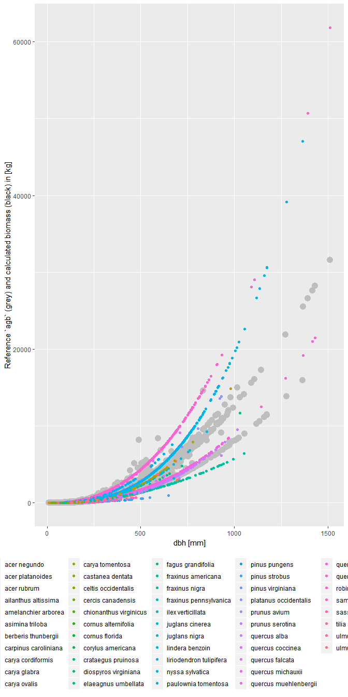

Plot dbh vs. biomass by species
================

``` r
# Setup
library(tidyverse)
#> -- Attaching packages --------------------------------------------- tidyverse 1.2.1 --
#> v ggplot2 3.1.0       v purrr   0.3.2  
#> v tibble  2.1.1       v dplyr   0.8.0.1
#> v tidyr   0.8.3       v stringr 1.4.0  
#> v readr   1.3.1       v forcats 0.4.0
#> -- Conflicts ------------------------------------------------ tidyverse_conflicts() --
#> x dplyr::filter() masks stats::filter()
#> x dplyr::lag()    masks stats::lag()
library(fgeo.biomass)
```

-----

The goal is to plot dbh (x) versus biomass (y) by species
([issue](https://github.com/forestgeo/allodb/issues/73)).

Let’s first drop rows with missing `dbh` values as we can’t calculate
biomass for them.

``` r
census <- fgeo.biomass::scbi_tree1 %>% 
  filter(!is.na(dbh))
```

Let’s find allometric equations in allodb and calculate biomass.

``` r
species <- fgeo.biomass::scbi_species
census_species <- census %>% 
  add_species(species, site = "SCBI")
#> Adding `site`.
#> Overwriting `sp`; it now stores Latin species names.
#> Adding `rowid`.

census_equations <- allo_find(census_species)
#>   Guessing `dbh` in [mm] (required to find dbh-specific equations).
#> You may provide the `dbh` unit manually via the argument `dbh_unit`.
#> * Matching equations by site and species.
#> * Refining equations according to dbh.
#> * Using generic equations where expert equations can't be found.
#> Warning:   Can't find equations matching these species:
#>   acer sp, carya sp, crataegus sp, fraxinus sp, hamamelis virginiana, juniperus virginiana, lonicera maackii, quercus prinus, quercus sp, rosa multiflora, rubus allegheniensis, rubus pensilvanicus, rubus phoenicolasius, ulmus sp, unidentified unk, viburnum prunifolium, viburnum recognitum
#> Warning: Can't find equations for 17377 rows (inserting `NA`).
```

Notice the warning that equations couldn’t be found. Here are some
reasons:

  - Some species in the data have no matching species in allodb.
  - The available equations were designed for a dbh range that doesn’t
    include actual dbh values in the data.
  - The available equations are a function of an independent variable
    that we still don’t support (e.g. dba).

Let’s drop those rows as we can’t calculate `biomass` for them.

``` r
# Useless for now
census_equations %>% 
  filter(is.na(eqn_id)) %>% 
  select(rowid, site, sp, eqn_id)
#> # A tibble: 17,377 x 4
#>    rowid site  sp                   eqn_id
#>    <int> <chr> <chr>                <chr> 
#>  1     1 scbi  lindera benzoin      <NA>  
#>  2     2 scbi  lindera benzoin      <NA>  
#>  3     3 scbi  lindera benzoin      <NA>  
#>  4     4 scbi  nyssa sylvatica      <NA>  
#>  5     5 scbi  hamamelis virginiana <NA>  
#>  6     6 scbi  hamamelis virginiana <NA>  
#>  7     7 scbi  unidentified unk     <NA>  
#>  8     9 scbi  viburnum prunifolium <NA>  
#>  9    10 scbi  asimina triloba      <NA>  
#> 10    11 scbi  asimina triloba      <NA>  
#> # ... with 17,367 more rows

# Dropping useless rows to continue
census_equations2 <- census_equations %>% 
  filter(!is.na(eqn_id))
```

We can now calculate `biomass`.

``` r
biomass <- allo_evaluate(census_equations2)
#> Warning:   Detected a single stem per tree. Consider these properties of the result:
#>   * For trees, `biomass` is that of the main stem.
#>   * For shrubs, `biomass` is that of the entire shrub.
#>   Do you need a multi-stem table?
#> Guessing `dbh` in [mm]
#> You may provide the `dbh` unit manually via the argument `dbh_unit`.
#> Converting `dbh` based on `dbh_unit`.
#> `biomass` values are given in [kg].
biomass
#> # A tibble: 13,804 x 2
#>    rowid biomass
#>    <int>   <dbl>
#>  1     8    5.69
#>  2    17   11.3 
#>  3    21  231.  
#>  4    22   10.3 
#>  5    26    4.15
#>  6    29  469.  
#>  7    34    3.44
#>  8    38    4.96
#>  9    64    1.83
#> 10    70   32.1 
#> # ... with 13,794 more rows
```

Let’s add `biomass` to the data we’ve been using.

``` r
census_equations_biomass <- census_equations2 %>%
  right_join(biomass)
#> Joining, by = "rowid"
census_equations_biomass
#> # A tibble: 14,042 x 34
#>    rowid treeID stemID tag   StemTag sp    quadrat    gx     gy DBHID
#>    <int>  <int>  <int> <chr> <chr>   <chr> <chr>   <dbl>  <dbl> <int>
#>  1     8      8      8 12261 1       lind~ 0125     18   484.      17
#>  2    17     17     17 20031 1       lind~ 0201     37.1   7.40    40
#>  3    21     21     21 20064 1       liri~ 0217     31.4 322.      69
#>  4    22     22     22 20090 1       lind~ 0204     39.1  67.3     70
#>  5    26     26     26 20120 1       ilex~ 0202     22.3  32.6     96
#>  6    29     29     29 20151 1       acer~ 0203     31.5  45.8    130
#>  7    34     34     34 20169 1       lind~ 0203     37.2  53.4    149
#>  8    38     38     38 20181 1       frax~ 0203     29.8  59.2    169
#>  9    64     64     64 20467 1       lind~ 0205     29.9  95.3    244
#> 10    70     70     70 20533 1       carp~ 0206     28.6 117.     266
#> # ... with 14,032 more rows, and 24 more variables: CensusID <int>,
#> #   dbh <dbl>, pom <chr>, hom <dbl>, ExactDate <chr>, DFstatus <chr>,
#> #   codes <chr>, nostems <dbl>, date <dbl>, status <chr>, agb <dbl>,
#> #   site <chr>, eqn_id <chr>, eqn <chr>, eqn_source <chr>, eqn_type <chr>,
#> #   anatomic_relevance <chr>, dbh_unit <chr>, bms_unit <chr>,
#> #   dbh_min_mm <dbl>, dbh_max_mm <dbl>, is_generic <lgl>, life_form <chr>,
#> #   biomass <dbl>
```

Now let’s box plot `biomass` by species.

``` r
census_equations_biomass %>% 
  ggplot(aes(sp, biomass)) +
  geom_boxplot() +
  ylab("biomass [kg]") +
  coord_flip()
```

<!-- -->

Let’s explore `dbh` versus `biomass`.

``` r
census_equations_biomass %>% 
  # Convert agb from [Mg] to [kg]
  mutate(agb_kg = agb * 1e3) %>% 
  ggplot(aes(dbh, biomass)) + 
  # Reference based on allometries for tropical trees
  geom_point(aes(y = agb_kg), color = "grey", size = 4) +
  geom_point(aes(y = biomass, color = sp)) +
  ylab("Reference `agb` (grey) and calculated biomass (black) in [kg]") +
  xlab("dbh [mm]") +
  theme(legend.position = "bottom")
```

<!-- -->

And now lets facet the plot by species.

``` r
census_equations_biomass %>% 
  # Convert agb from [Mg] to [kg]
  mutate(agb_kg = agb * 1e3) %>% 
  ggplot(aes(x = dbh)) +
  geom_point(aes(y = agb_kg), size = 1.5, color = "grey") +
  geom_point(aes(y = biomass), size = 1, color = "black") +
  facet_wrap("sp", ncol = 4) +
  ylab("Reference `agb` (grey) and calculated `biomass` (black) in [kg]") +
  xlab("dbh [mm]") +
  theme_bw()
```

<!-- -->
