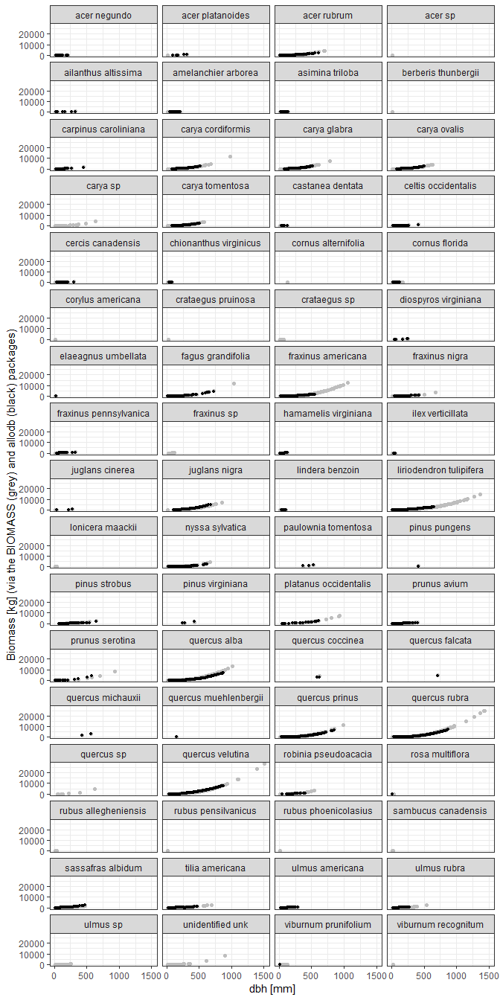

<!-- README.md is generated from README.Rmd. Please edit that file -->

#  Calculate biomass

[](https://www.tidyverse.org/lifecycle/#experimental)
[](https://travis-ci.org/forestgeo/fgeo.biomass)
[](https://coveralls.io/r/forestgeo/fgeo.biomass?branch=master)
[](https://cran.r-project.org/package=fgeo.biomass)

The goal of fgeo.biomass is to calculate biomass using
[ForestGEO](https://forestgeo.si.edu/) data and equations from either
the [BIOMASS package](https://CRAN.R-project.org/package=BIOMASS) or the
[allodb package](https://forestgeo.github.io/allodb/).

  - The BIOMASS package is applicable to tropical forests. It was first
    [published on CRAN in 2016](https://cran.r-project.org/) and on
    [Methods on Ecology and Evolution
    in 2017](https://besjournals.onlinelibrary.wiley.com/doi/abs/10.1111/2041-210X.12753).
    fgeo.biomass provides the main features of BIOMASS with a simpler
    interface, consistent with all [fgeo
    packages](https://forestgeo.github.io/fgeo/).

  - The allodb package is work in progress, and aims to provide
    expert-selected allometric equations, both for tropical and
    temperate forests. fgeo.biomass provides a simple interface to
    automate the process of finding the right equation(s) for each stem
    and computing biomass.

## Installation

Install the development version of **fgeo.biomass** with:

    # install.packages("devtools")
    devtools::install_github("forestgeo/fgeo.biomass")

## Setup

In addition to the fgeo.biomass package we will use dplyr and ggplot2
for data wrangling and plotting.

``` r
library(ggplot2)
library(dplyr)
library(fgeo.biomass)
```

## fgeo.biomass wrapping BIOMASS

We’ll use data from the [Barro Colorado Island,
Panama](https://forestgeo.si.edu/sites/neotropics/barro-colorado-island)
(BCI). We first pick alive trees and drop missing `dbh` values as we
can’t calculate biomass for them.

``` r
bci_tree <- as_tibble(bciex::bci12t7mini) %>% 
  filter(status == "A", !is.na(dbh))
bci_tree
#> # A tibble: 538 x 20
#>    treeID stemID tag   StemTag sp    quadrat    gx    gy MeasureID CensusID
#>     <int>  <int> <chr> <chr>   <chr> <chr>   <dbl> <dbl>     <int>    <int>
#>  1    858      1 0008~ ""      apei~ 4402     899.  42         766      171
#>  2   1129      1 0011~ ""      quar~ 4308     867. 163.        995      171
#>  3   2143      1 0021~ ""      beil~ 3715     744  305.       1829      171
#>  4   2388     10 0023~ 1       lueh~ 3622     724. 447.       2007      171
#>  5   4448      1 0044~ ""      sima~ 2321     477. 428.       3741      171
#>  6   5877      1 0059~ ""      quar~ 1303     280.  70.4      4800      171
#>  7   6487      1 0065~ ""      alse~ 1108     221. 178.       5226      171
#>  8   8651      1 0105~ ""      hyba~ 4811     974. 228.       6832      171
#>  9   9480      1 0114~ ""      fara~ 4814     977. 290        7373      171
#> 10  10179     11 0121~ <NA>    hyba~ 4819     979. 395.       7898      171
#> # ... with 528 more rows, and 10 more variables: dbh <dbl>, pom <chr>,
#> #   hom <dbl>, ExactDate <chr>, DFstatus <chr>, codes <chr>,
#> #   nostems <dbl>, date <dbl>, status <chr>, agb <dbl>
```

We also need species data.

``` r
bci_species <- as_tibble(bciex::bci_species)
bci_species
#> # A tibble: 1,414 x 13
#>    sp    Latin Genus Species Family SpeciesID SubspeciesID Authority
#>    <chr> <chr> <chr> <chr>   <chr>      <int>        <int> <chr>    
#>  1 call~ Call~ Call~ laxa    Fabac~       131            1 (Benth.)~
#>  2 pout~ Pout~ Pout~ glomer~ Sapot~       811            2 (Miq.) R~
#>  3 pout~ Pout~ Pout~ glomer~ Sapot~       811            3 (Miq.) R~
#>  4 prot~ Prot~ Prot~ tenuif~ Burse~       828            4 (I.M. Jo~
#>  5 soro~ Soro~ Soro~ pubive~ Morac~       959            5 Hensl.   
#>  6 soro~ Soro~ Soro~ pubive~ Morac~       959            6 Hensl.   
#>  7 swar~ Swar~ Swar~ simplex Fabac~       980            7 (Raddi) ~
#>  8 hibi~ Tali~ Tali~ tiliac~ Malva~       997            9 (Arruda)~
#>  9 quar~ Quar~ Quar~ astero~ Malva~       871           10 (Pittier~
#> 10 inga~ Inga~ Inga  ciliata Fabac~      1278           11 T.D.Penn.
#> # ... with 1,404 more rows, and 5 more variables: IDLevel <chr>,
#> #   syn <chr>, subsp <chr>, wsg <dbl>, wsglevel <chr>
```

`add_tropical_biomass()` adds biomass to your census data.

``` r
biomass <- add_tropical_biomass(bci_tree, bci_species)
#> <U+2714> Guessing dbh in [mm].
#> i You may provide the dbh unit manually via the argument`dbh_unit`.
#> i Wood density given in [g/cm^3].
#> <U+2714> Using 'Pantropical' `region`.
#> i Biomass is given in [kg].
#> <U+2714> Adding new columns:
#>   family, genus, species, wd_level, wd_mean, wd_sd, biomass
biomass
#> # A tibble: 538 x 27
#>    treeID stemID tag   StemTag sp    quadrat    gx    gy MeasureID CensusID
#>     <int>  <int> <chr> <chr>   <chr> <chr>   <dbl> <dbl>     <int>    <int>
#>  1    858      1 0008~ ""      apei~ 4402     899.  42         766      171
#>  2   1129      1 0011~ ""      quar~ 4308     867. 163.        995      171
#>  3   2143      1 0021~ ""      beil~ 3715     744  305.       1829      171
#>  4   2388     10 0023~ 1       lueh~ 3622     724. 447.       2007      171
#>  5   4448      1 0044~ ""      sima~ 2321     477. 428.       3741      171
#>  6   5877      1 0059~ ""      quar~ 1303     280.  70.4      4800      171
#>  7   6487      1 0065~ ""      alse~ 1108     221. 178.       5226      171
#>  8   8651      1 0105~ ""      hyba~ 4811     974. 228.       6832      171
#>  9   9480      1 0114~ ""      fara~ 4814     977. 290        7373      171
#> 10  10179     11 0121~ <NA>    hyba~ 4819     979. 395.       7898      171
#> # ... with 528 more rows, and 17 more variables: dbh <dbl>, pom <chr>,
#> #   hom <dbl>, ExactDate <chr>, DFstatus <chr>, codes <chr>,
#> #   nostems <dbl>, date <dbl>, status <chr>, agb <dbl>, family <chr>,
#> #   genus <chr>, species <chr>, wd_level <chr>, wd_mean <dbl>,
#> #   wd_sd <dbl>, biomass <dbl>
```

You may also provide a specific `region` or `latitude` and `longitude`.

``` r
biomass <- add_tropical_biomass(
  bci_tree, 
  bci_species,
  latitude = 9.154965, 
  longitude = -79.845884
)
#> <U+2714> Guessing dbh in [mm].
#> i You may provide the dbh unit manually via the argument`dbh_unit`.
#> i Wood density given in [g/cm^3].
#> <U+2714> Using `latitude` and `longitude` (ignoring `region`).
#> i Biomass is given in [kg].
#> <U+2714> Adding new columns:
#>   family, genus, species, wd_level, wd_mean, wd_sd, latitude, longitude, biomass

biomass %>% 
  select(biomass, everything())
#> # A tibble: 538 x 29
#>    biomass treeID stemID tag   StemTag sp    quadrat    gx    gy MeasureID
#>      <dbl>  <int>  <int> <chr> <chr>   <chr> <chr>   <dbl> <dbl>     <int>
#>  1 2397.      858      1 0008~ ""      apei~ 4402     899.  42         766
#>  2 1884.     1129      1 0011~ ""      quar~ 4308     867. 163.        995
#>  3  264.     2143      1 0021~ ""      beil~ 3715     744  305.       1829
#>  4  911.     2388     10 0023~ 1       lueh~ 3622     724. 447.       2007
#>  5  961.     4448      1 0044~ ""      sima~ 2321     477. 428.       3741
#>  6 2473.     5877      1 0059~ ""      quar~ 1303     280.  70.4      4800
#>  7  570.     6487      1 0065~ ""      alse~ 1108     221. 178.       5226
#>  8    2.12   8651      1 0105~ ""      hyba~ 4811     974. 228.       6832
#>  9   16.0    9480      1 0114~ ""      fara~ 4814     977. 290        7373
#> 10    2.49  10179     11 0121~ <NA>    hyba~ 4819     979. 395.       7898
#> # ... with 528 more rows, and 19 more variables: CensusID <int>,
#> #   dbh <dbl>, pom <chr>, hom <dbl>, ExactDate <chr>, DFstatus <chr>,
#> #   codes <chr>, nostems <dbl>, date <dbl>, status <chr>, agb <dbl>,
#> #   family <chr>, genus <chr>, species <chr>, wd_level <chr>,
#> #   wd_mean <dbl>, wd_sd <dbl>, latitude <dbl>, longitude <dbl>
```

`propagate_errors()` allows you to propagate errors.

``` r
str(
  propagate_errors(biomass)
)
#> List of 5
#>  $ meanAGB       : num 20.9
#>  $ medAGB        : num 20.6
#>  $ sdAGB         : num 2.32
#>  $ credibilityAGB: Named num [1:2] 16.8 26.2
#>   ..- attr(*, "names")= chr [1:2] "2.5%" "97.5%"
#>  $ AGB_simu      : num [1:538, 1:1000] 1.49 1.907 0.219 1.487 1.125 ...
#>   ..- attr(*, "dimnames")=List of 2
#>   .. ..$ : NULL
#>   .. ..$ : chr [1:1000] "203" "817" "977" "933" ...
```

`model_height()` allows you to create a height model, which you can use
to propagate height errors. This is what the entire pipeline looks like:

``` r
model <- model_height(bci_tree)
#> i Using `method` log1 (other methods: log2, weibull, michaelis).

errors <- bci_tree %>% 
  add_tropical_biomass(bci_species) %>% 
  propagate_errors(height_model = model)
#> <U+2714> Guessing dbh in [mm].
#> i You may provide the dbh unit manually via the argument`dbh_unit`.
#> i Wood density given in [g/cm^3].
#> <U+2714> Using 'Pantropical' `region`.
#> i Biomass is given in [kg].
#> <U+2714> Adding new columns:
#>   family, genus, species, wd_level, wd_mean, wd_sd, biomass
#> <U+2714> Propagating errors on measurements of wood density.
#> <U+2714> Propagating errors on measurements of height.

str(errors)
#> List of 5
#>  $ meanAGB       : num 21.6
#>  $ medAGB        : num 21.4
#>  $ sdAGB         : num 2.09
#>  $ credibilityAGB: Named num [1:2] 18.1 26.2
#>   ..- attr(*, "names")= chr [1:2] "2.5%" "97.5%"
#>  $ AGB_simu      : num [1:538, 1:1000] 2.506 0.881 0.376 1.277 1.019 ...
```

If you pass `latitude` and `longitude` to `add_tropical_biomass(), and
then you pass a`height\_model`to`propagate\_errors()\`, then you will
need to ignore the coordinates. On an interactive session, you should
see something like this:


``` r
if (interactive()) {
  errors <- bci_tree %>% 
    add_tropical_biomass(
      bci_species, 
      latitude = 9.154965, 
      longitude = -79.845884
    ) %>% 
    propagate_errors(height_model = model)
  
  str(errors)
}
```

`add_wood_density()` adds wood density to your census data. It is not
limited to tropical forests, and has support for all of these regions:
AfricaExtraTrop, AfricaTrop, Australia, AustraliaTrop,
CentralAmericaTrop, China, Europe, India, Madagascar, Mexico,
NorthAmerica, Oceania, SouthEastAsia, SouthEastAsiaTrop,
SouthAmericaExtraTrop, SouthAmericaTrop, and World.

``` r
wood_density <- add_wood_density(bci_tree, bci_species)
#> i Wood density given in [g/cm^3].

wood_density %>% 
  select(starts_with("wd_"), everything())
#> # A tibble: 538 x 26
#>    wd_level wd_mean  wd_sd treeID stemID tag   StemTag sp    quadrat    gx
#>    <chr>      <dbl>  <dbl>  <int>  <int> <chr> <chr>   <chr> <chr>   <dbl>
#>  1 genus      0.255 0.0941    858      1 0008~ ""      apei~ 4402     899.
#>  2 species    0.454 0.0708   1129      1 0011~ ""      quar~ 4308     867.
#>  3 genus      0.563 0.0941   2143      1 0021~ ""      beil~ 3715     744 
#>  4 species    0.417 0.0708   2388     10 0023~ 1       lueh~ 3622     724.
#>  5 species    0.383 0.0708   4448      1 0044~ ""      sima~ 2321     477.
#>  6 species    0.454 0.0708   5877      1 0059~ ""      quar~ 1303     280.
#>  7 species    0.536 0.0708   6487      1 0065~ ""      alse~ 1108     221.
#>  8 species    0.67  0.0708   8651      1 0105~ ""      hyba~ 4811     974.
#>  9 species    0.584 0.0708   9480      1 0114~ ""      fara~ 4814     977.
#> 10 species    0.67  0.0708  10179     11 0121~ <NA>    hyba~ 4819     979.
#> # ... with 528 more rows, and 16 more variables: gy <dbl>,
#> #   MeasureID <int>, CensusID <int>, dbh <dbl>, pom <chr>, hom <dbl>,
#> #   ExactDate <chr>, DFstatus <chr>, codes <chr>, nostems <dbl>,
#> #   date <dbl>, status <chr>, agb <dbl>, family <chr>, genus <chr>,
#> #   species <chr>
```

The BIOMASS package provides a tool to correct taxonomic names.
fgeo.biomass does not include that feature. You may use BIOMASS directly
or the more focused [taxize
package](https://cran.r-project.org/web/packages/taxize/taxize.pdf).

## fgeo.biomass wrapping allodb

## Warning

These features are not ready for research. We are now building a
[Minimum Viable
Product](https://en.wikipedia.org/wiki/Minimum_viable_product), with
just enough features to collect feedback from alpha users and redirect
our effort. The resulting biomass is still meaningless.

We’ll use the `add_biomass()` with these inputs:

1.  A ForestGEO-like *stem* or *tree* table.
2.  A *species* table (internally used to look up the Latin species
    names from the species codes in the `sp` column of the census
    table).

We’ll use data from the [Smithsonian Conservation Biology Institute,
USA](https://forestgeo.si.edu/sites/north-america/smithsonian-conservation-biology-institute)
(SCBI). We first pick alive trees and drop missing `dbh` values as we
can’t calculate biomass for them.

``` r
census <- fgeo.biomass::scbi_tree1 %>% 
  filter(status == "A", !is.na(dbh))

census
#> # A tibble: 30,050 x 20
#>    treeID stemID tag   StemTag sp    quadrat    gx    gy DBHID CensusID
#>     <int>  <int> <chr> <chr>   <chr> <chr>   <dbl> <dbl> <int>    <int>
#>  1      1      1 10079 1       libe  0104     3.70  73       1        1
#>  2      2      2 10168 1       libe  0103    17.3   58.9     3        1
#>  3      3      3 10567 1       libe  0110     9    197.      5        1
#>  4      4      4 12165 1       nysy  0122    14.2  428.      7        1
#>  5      5      5 12190 1       havi  0122     9.40 436.      9        1
#>  6      6      6 12192 1       havi  0122     1.30 434      13        1
#>  7      8      8 12261 1       libe  0125    18    484.     17        1
#>  8      9      9 12456 1       vipr  0130    18    598.     19        1
#>  9     10     10 12551 1       astr  0132     5.60 628.     22        1
#> 10     11     11 12608 1       astr  0132    13.3  623.     24        1
#> # ... with 30,040 more rows, and 10 more variables: dbh <dbl>, pom <chr>,
#> #   hom <dbl>, ExactDate <chr>, DFstatus <chr>, codes <chr>,
#> #   nostems <dbl>, date <dbl>, status <chr>, agb <dbl>
```

We now use `add_biomass()` to add biomass to our census dataset.

``` r
species <- fgeo.biomass::scbi_species

with_biomass <- census %>% 
  add_biomass(species, site = "SCBI")
#> <U+2714> Guessing dbh in [mm].
#> i You may provide the dbh unit manually via the argument`dbh_unit`.
#> i biomass values are given in [kg].
#> <U+2714> Guessing dbh in [mm].
#> i You may provide the dbh unit manually via the argument`dbh_unit`.
#> <U+2714> Matching equations by site and species.
#> <U+2714> Refining equations according to dbh.
#> <U+2714> Using generic equations where expert equations can't be found.
#> Warning:   Can't find equations matching these species:
#>   acer sp, carya sp, crataegus sp, fraxinus sp, quercus sp, ulmus sp, unidentified unk
#> Warning: Can't find equations for 15028 rows (inserting `NA`).
#> Warning: Detected a single stem per tree. Do you need a multi-stem table?
#> Warning: * For trees, `biomass` is that of the main stem.
#> Warning: * For shrubs, `biomass` is that of the entire shrub.
#> <U+2714> Adding new columns:
#>   rowid, species, site, biomass
```

We are warned that we are using a tree-table (as opposed to a
stem-table), and informed about how to interpret the resulting `biomass`
values for trees and shrubs.

Some equations couldn’t be found. There may be two reasons:

  - Some stems in the data belong to species with no matching species in
    allodb.
  - Some stems in the data belong to species that do match species in
    allodb but the available equations were designed for a dbh range
    that doesn’t include actual dbh values in the data.

Here are the most interesting columns of the result:

``` r
with_biomass %>% 
  select(treeID, species, biomass)
#> # A tibble: 30,050 x 3
#>    treeID species              biomass
#>     <int> <chr>                  <dbl>
#>  1      1 lindera benzoin       NA    
#>  2      2 lindera benzoin       NA    
#>  3      3 lindera benzoin       NA    
#>  4      4 nyssa sylvatica       58.5  
#>  5      5 hamamelis virginiana  17.6  
#>  6      6 hamamelis virginiana   0.400
#>  7      8 lindera benzoin        5.69 
#>  8      9 viburnum prunifolium  NA    
#>  9     10 asimina triloba       NA    
#> 10     11 asimina triloba       NA    
#> # ... with 30,040 more rows
```

Let’s now visualize the relationship between `dbh` and b`biomass` by
`species` (black points), in comparison with `agb` (above ground
biomass) values calculated with allometric equations for tropical trees
(grey points).

``` r
with_biomass %>% 
  # Convert agb from [Mg] to [kg]
  mutate(agb_kg = agb * 1e3) %>% 
  ggplot(aes(x = dbh)) +
  geom_point(aes(y = agb_kg), size = 1.5, color = "grey") +
  geom_point(aes(y = biomass), size = 1, color = "black") +
  facet_wrap("species", ncol = 4) +
  ylab("Reference `agb` (grey) and calculated `biomass` (black) in [kg]") +
  xlab("dbh [mm]") +
  theme_bw()
#> Warning: Removed 15028 rows containing missing values (geom_point).
```

<!-- -->

Above, the species for which `biomass` couldn’t be calculated show no
black points, although they do show grey reference-points.

To better understand the distribution of `biomass` values for each
species we can use a box-plot.

``` r
with_biomass %>% 
  ggplot(aes(species, biomass)) +
  geom_boxplot() +
  ylab("biomass [kg]") +
  coord_flip()
#> Warning: Removed 15028 rows containing non-finite values (stat_boxplot).
```

<!-- -->

For some species the maximum `dbh` for which `biomass` was calculated is
much lower than the maximum `dbh` value for which the reference `agb`
was calculated. This is because most equations in **allodb** are defined
for a specific range of `dbh` values. Eventually **allodb** might
provide equations beyond the `dbh` limits currently available.

To explore this issue, here we use `add_component_biomass()` which
allows us to see intermediary results that `add_biomass()` doesn’t show.

``` r
detailed_biomass <- suppressWarnings(suppressMessages(
  add_component_biomass(census, species, site = "SCBI")
))
#> <U+2714> Guessing dbh in [mm].
#> i You may provide the dbh unit manually via the argument`dbh_unit`.
#> i biomass values are given in [kg].
#> <U+2714> Guessing dbh in [mm].
#> i You may provide the dbh unit manually via the argument`dbh_unit`.

# Maximum `dbh` values by species
max_by_species <- detailed_biomass %>% 
  select(species, dbh_max_mm) %>% 
  group_by(species) %>% 
  arrange(desc(dbh_max_mm)) %>% 
  filter(row_number() == 1L) %>% 
  ungroup()

# `dbh` is above the maximum limit, so `biomass` is missing (agb has a value)
detailed_biomass %>% 
  filter(dbh > 1000) %>% 
  select(-dbh_max_mm) %>% 
  left_join(max_by_species) %>% 
  mutate(agb_kg = agb * 1e3) %>%
  select(species, biomass, agb, dbh, dbh_max_mm) %>% 
  arrange(species) %>%
  print(n = Inf)
#> Joining, by = "species"
#> # A tibble: 23 x 5
#>    species                 biomass   agb   dbh dbh_max_mm
#>    <chr>                     <dbl> <dbl> <dbl>      <dbl>
#>  1 fagus grandifolia            NA 13.7  1030.        890
#>  2 fraxinus americana           NA 14.2  1053.        550
#>  3 liriodendron tulipifera      NA  8.24 1012.        650
#>  4 liriodendron tulipifera      NA 11.2  1159.        650
#>  5 liriodendron tulipifera      NA 10.3  1118.        650
#>  6 liriodendron tulipifera      NA 10.6  1135.        650
#>  7 liriodendron tulipifera      NA  8.48 1025.        650
#>  8 liriodendron tulipifera      NA 15.9  1365.        650
#>  9 liriodendron tulipifera      NA  8.12 1006.        650
#> 10 liriodendron tulipifera      NA 11.5  1173.        650
#> 11 liriodendron tulipifera      NA 11.5  1174.        650
#> 12 liriodendron tulipifera      NA  9.02 1054         650
#> 13 liriodendron tulipifera      NA 13.9  1280.        650
#> 14 quercus alba                 NA 15.0  1018.        890
#> 15 quercus rubra                NA 27.7  1418.        890
#> 16 quercus rubra                NA 28.2  1432.        890
#> 17 quercus rubra                NA 25.5  1366.        890
#> 18 quercus rubra                NA 17.3  1143.        890
#> 19 quercus rubra                NA 21.9  1272.        890
#> 20 quercus velutina             NA 16.1  1107         890
#> 21 quercus velutina             NA 26.6  1393.        890
#> 22 quercus velutina             NA 15.6  1092.        890
#> 23 quercus velutina             NA 31.6  1511.        890
```

## Biomass via BIOMASS versus allodb

``` r
temperate_biomass <- add_biomass(census, species, site = "scbi")
#> <U+2714> Guessing dbh in [mm].
#> i You may provide the dbh unit manually via the argument`dbh_unit`.
#> i biomass values are given in [kg].
#> <U+2714> Guessing dbh in [mm].
#> i You may provide the dbh unit manually via the argument`dbh_unit`.
#> <U+2714> Matching equations by site and species.
#> <U+2714> Refining equations according to dbh.
#> <U+2714> Using generic equations where expert equations can't be found.
#> Warning:   Can't find equations matching these species:
#>   acer sp, carya sp, crataegus sp, fraxinus sp, quercus sp, ulmus sp, unidentified unk
#> Warning: Can't find equations for 15028 rows (inserting `NA`).
#> Warning: Detected a single stem per tree. Do you need a multi-stem table?
#> Warning: * For trees, `biomass` is that of the main stem.
#> Warning: * For shrubs, `biomass` is that of the entire shrub.
#> <U+2714> Adding new columns:
#>   rowid, species, site, biomass

# Incorrect but possible
tropical_biomass <- add_tropical_biomass(census, species)
#> <U+2714> Guessing dbh in [mm].
#> i You may provide the dbh unit manually via the argument`dbh_unit`.
#> i Wood density given in [g/cm^3].
#> <U+2714> Using 'Pantropical' `region`.
#> i Biomass is given in [kg].
#> <U+2714> Adding new columns:
#>   family, genus, species, wd_level, wd_mean, wd_sd, biomass

dbh_biomsss <- tibble(
  dbh = temperate_biomass$dbh,
  species = temperate_biomass$species,
  temperate_biomass = temperate_biomass$biomass, 
  tropical_biomass = tropical_biomass$biomass
)
```

``` r
dbh_biomsss %>% 
  ggplot(aes(x = dbh)) +
  geom_point(aes(y = tropical_biomass), size = 1.5, color = "grey") +
  geom_point(aes(y = temperate_biomass), size = 1) +
  facet_wrap("species", ncol = 4) +
  ylab("Biomass [kg] (via the BIOMASS (grey) and allodb (black) packages)") +
  xlab("dbh [mm]") +
  theme_bw()
#> Warning: Removed 15028 rows containing missing values (geom_point).
```

<!-- -->

## General information

  - [Getting help](SUPPORT.md).
  - [Contributing](CONTRIBUTING.md).
  - [Contributor Code of Conduct](CODE_OF_CONDUCT.md).
