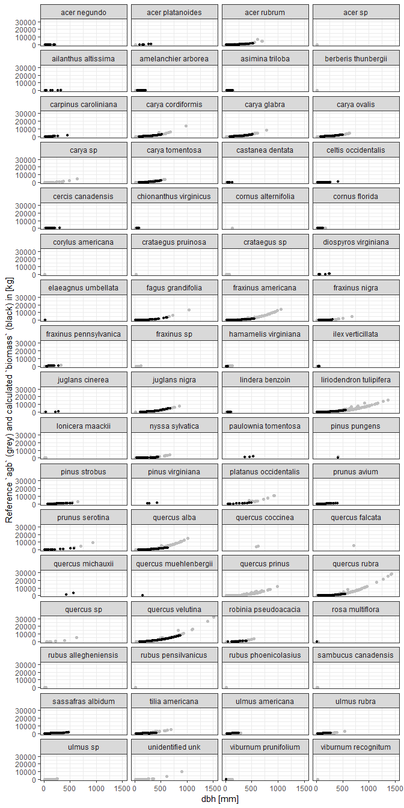
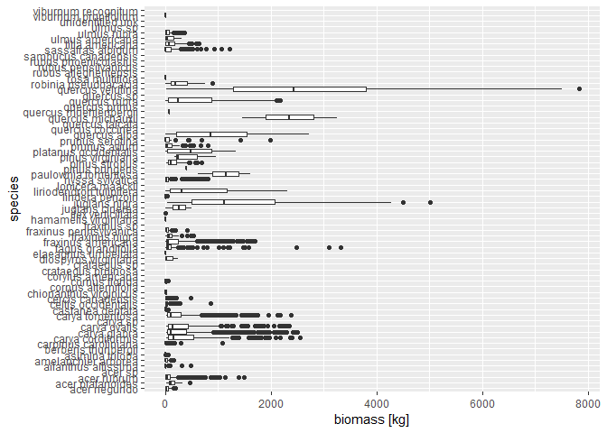

<!-- README.md is generated from README.Rmd. Please edit that file -->

#  Calculate biomass

[](https://www.tidyverse.org/lifecycle/#experimental)
[](https://travis-ci.org/forestgeo/fgeo.biomass)
[](https://coveralls.io/r/forestgeo/fgeo.biomass?branch=master)
[](https://cran.r-project.org/package=fgeo.biomass)

The goal of **fgeo.biomass** is to calculate biomass using best
available allometric-equations from the
[**allodb**](https://forestgeo.github.io/allodb/) package.

## Warning

This package is not ready for research. We are now building a [Minimum
Viable Product](https://en.wikipedia.org/wiki/Minimum_viable_product),
with just enough features to collect feedback from alpha users and
redirect our effort. The resulting biomass is still meaningless. For a
working product see the
[BIOMASS](https://CRAN.R-project.org/package=BIOMASS) package.

## Installation

Install the development version of **fgeo.biomass** with:

    # install.packages("devtools")
    devtools::install_github("forestgeo/fgeo.biomass")

## Example

In addition to the fgeo.biomass package we will use dplyr and ggplot2
for data wrangling and plotting.

``` r
library(ggplot2)
library(dplyr)
library(fgeo.biomass)
```

We’ll use the `add_biomass()` with these inputs:

1.  A ForestGEO-like *stem* or *tree* table.
2.  A *species* table (internally used to look up the Latin species
    names from the species codes in the `sp` column of the census
    table).

We’ll use data from the [Smithsonian Conservation Biology
Institute](https://forestgeo.si.edu/sites/north-america/smithsonian-conservation-biology-institute)
(SCBI). We first pick alive trees and drop missing `dbh` values as we
can’t calculate biomass for them.

``` r
census <- fgeo.biomass::scbi_tree1 %>% 
  filter(status == "A", !is.na(dbh))

census
#> # A tibble: 30,050 x 20
#>    treeID stemID tag   StemTag sp    quadrat    gx    gy DBHID CensusID
#>     <int>  <int> <chr> <chr>   <chr> <chr>   <dbl> <dbl> <int>    <int>
#>  1      1      1 10079 1       libe  0104     3.70  73       1        1
#>  2      2      2 10168 1       libe  0103    17.3   58.9     3        1
#>  3      3      3 10567 1       libe  0110     9    197.      5        1
#>  4      4      4 12165 1       nysy  0122    14.2  428.      7        1
#>  5      5      5 12190 1       havi  0122     9.40 436.      9        1
#>  6      6      6 12192 1       havi  0122     1.30 434      13        1
#>  7      8      8 12261 1       libe  0125    18    484.     17        1
#>  8      9      9 12456 1       vipr  0130    18    598.     19        1
#>  9     10     10 12551 1       astr  0132     5.60 628.     22        1
#> 10     11     11 12608 1       astr  0132    13.3  623.     24        1
#> # ... with 30,040 more rows, and 10 more variables: dbh <dbl>, pom <chr>,
#> #   hom <dbl>, ExactDate <chr>, DFstatus <chr>, codes <chr>,
#> #   nostems <dbl>, date <dbl>, status <chr>, agb <dbl>
```

We now use `add_biomass()` to add biomass to our census dataset.

``` r
species <- fgeo.biomass::scbi_species

with_biomass <- census %>% 
  add_biomass(species, site = "SCBI")
#> Guessing `dbh` in [mm]
#> You may provide the `dbh` unit manually via the argument `dbh_unit`.
#> `biomass` values are given in [kg].
#> * Matching equations by site and species.
#> * Refining equations according to dbh.
#> * Using generic equations where expert equations can't be found.
#> Warning:   Can't find equations matching these species:
#>   acer sp, carya sp, crataegus sp, fraxinus sp, quercus prinus, quercus sp, ulmus sp, unidentified unk
#> Warning: Can't find equations for 1 rows (inserting `NA`).
#> Warning: Detected a single stem per tree. Do you need a multi-stem table?
#> Warning: * For trees, `biomass` is that of the main stem.
#> Warning: * For shrubs, `biomass` is that of the entire shrub.
#> Adding new columns:
#> 'rowid','species','site','biomass'
```

We are warned that we are using a tree-table (as opposed to a
stem-table), and informed about how to interpret the resulting `biomass`
values for trees and shrubs.

Some equations couldn’t be found. There may be two reasons:

  - Some stems in the data belong to species with no matching species in
    allodb.
  - Some stems in the data belong to species that do match species in
    allodb but the available equations were designed for a dbh range
    that doesn’t include actual dbh values in the data.

Here are the most interesting columns of the result:

``` r
with_biomass %>% 
  select(treeID, species, biomass)
#> # A tibble: 30,050 x 3
#>    treeID species              biomass
#>     <int> <chr>                  <dbl>
#>  1      1 lindera benzoin       NA    
#>  2      2 lindera benzoin       NA    
#>  3      3 lindera benzoin       NA    
#>  4      4 nyssa sylvatica       NA    
#>  5      5 hamamelis virginiana  NA    
#>  6      6 hamamelis virginiana   0.400
#>  7      8 lindera benzoin        5.69 
#>  8      9 viburnum prunifolium  NA    
#>  9     10 asimina triloba       NA    
#> 10     11 asimina triloba       NA    
#> # ... with 30,040 more rows
```

Let’s now visualize the relationship between `dbh` and b`biomass` by
`species` (black points), in comparison with `agb` (above ground
biomass) values calculated with allometric equations for tropical trees
(grey points).

``` r
with_biomass %>% 
  # Convert agb from [Mg] to [kg]
  mutate(agb_kg = agb * 1e3) %>% 
  ggplot(aes(x = dbh)) +
  geom_point(aes(y = agb_kg), size = 1.5, color = "grey") +
  geom_point(aes(y = biomass), size = 1, color = "black") +
  facet_wrap("species", ncol = 4) +
  ylab("Reference `agb` (grey) and calculated `biomass` (black) in [kg]") +
  xlab("dbh [mm]") +
  theme_bw()
#> Warning: Removed 16385 rows containing missing values (geom_point).
```

<!-- -->

Above, the species for which `biomass` couldn’t be calculated show no
black points, although they do show grey reference-points.

To better understand the distribution of `biomass` values for each
species we can use a box-plot.

``` r
with_biomass %>% 
  ggplot(aes(species, biomass)) +
  geom_boxplot() +
  ylab("biomass [kg]") +
  coord_flip()
#> Warning: Removed 16385 rows containing non-finite values (stat_boxplot).
```

<!-- -->

For some species the maximum `dbh` for which `biomass` was calculated is
much lower than the maximum `dbh` value for which the reference `agb`
was calculated. This is because most equations in **allodb** are defined
for a specific range of `dbh` values. Eventually **allodb** might
provide equations beyond the `dbh` limits currently available.

To explore this issue, here we use `add_component_biomass()` which
allows us to see intermediary results that `add_biomass()` doesn’t show.

``` r
detailed_biomass <- suppressWarnings(suppressMessages(
  add_component_biomass(census, species, site = "SCBI")
))

# Maximum `dbh` values by species
max_by_species <- detailed_biomass %>% 
  select(species, dbh_max_mm) %>% 
  group_by(species) %>% 
  arrange(desc(dbh_max_mm)) %>% 
  filter(row_number() == 1L) %>% 
  ungroup()

# `dbh` is above the maximum limit, so `biomass` is missing (agb has a value)
detailed_biomass %>% 
  filter(dbh > 1000) %>% 
  select(-dbh_max_mm) %>% 
  left_join(max_by_species) %>% 
  mutate(agb_kg = agb * 1e3) %>%
  select(species, biomass, agb, dbh, dbh_max_mm) %>% 
  arrange(species) %>%
  print(n = Inf)
#> Joining, by = "species"
#> # A tibble: 23 x 5
#>    species                 biomass   agb   dbh dbh_max_mm
#>    <chr>                     <dbl> <dbl> <dbl>      <dbl>
#>  1 fagus grandifolia            NA 13.7  1030.       630 
#>  2 fraxinus americana           NA 14.2  1053.       550 
#>  3 liriodendron tulipifera      NA  8.24 1012.       558.
#>  4 liriodendron tulipifera      NA 11.2  1159.       558.
#>  5 liriodendron tulipifera      NA 10.3  1118.       558.
#>  6 liriodendron tulipifera      NA 10.6  1135.       558.
#>  7 liriodendron tulipifera      NA  8.48 1025.       558.
#>  8 liriodendron tulipifera      NA 15.9  1365.       558.
#>  9 liriodendron tulipifera      NA  8.12 1006.       558.
#> 10 liriodendron tulipifera      NA 11.5  1173.       558.
#> 11 liriodendron tulipifera      NA 11.5  1174.       558.
#> 12 liriodendron tulipifera      NA  9.02 1054        558.
#> 13 liriodendron tulipifera      NA 13.9  1280.       558.
#> 14 quercus alba                 NA 15.0  1018.       630 
#> 15 quercus rubra                NA 27.7  1418.       550 
#> 16 quercus rubra                NA 28.2  1432.       550 
#> 17 quercus rubra                NA 25.5  1366.       550 
#> 18 quercus rubra                NA 17.3  1143.       550 
#> 19 quercus rubra                NA 21.9  1272.       550 
#> 20 quercus velutina             NA 16.1  1107        889 
#> 21 quercus velutina             NA 26.6  1393.       889 
#> 22 quercus velutina             NA 15.6  1092.       889 
#> 23 quercus velutina             NA 31.6  1511.       889
```

## General information

  - [Getting help](SUPPORT.md).
  - [Contributing](CONTRIBUTING.md).
  - [Contributor Code of Conduct](CODE_OF_CONDUCT.md).

## Related project

  - [BIOMASS](https://CRAN.R-project.org/package=BIOMASS)
